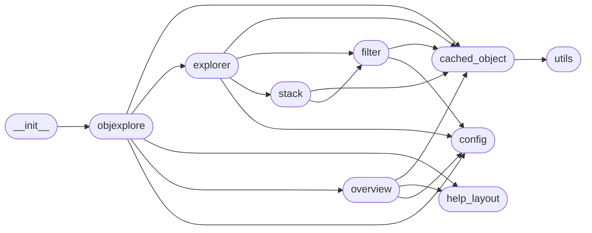

# Code Overview

[_Documentation generated by Documatic_](https://www.documatic.com)

<!---Documatic-section-Codebase Structure Python-start--->
## Codebase Structure Python

The codebase has a flat structure, with 10 code files.

<!---Documatic-block-system_architecture-start--->

<!---Documatic-block-system_architecture-end--->

# #
<!---Documatic-section-Codebase Structure Python-end--->

<!---Documatic-section-Key Objects-start--->
## Key Objects

There are exposed imports at level-0
from the source directory (objexplore)

<!---Documatic-block-objexplore-start--->

	
<code>objexplore</code> (Click to Expand!)

* `objexplore.objexplore.explore`
* `objexplore.objexplore.version`

<!---Documatic-block-objexplore-end--->

# #
<!---Documatic-section-Key Objects-end--->

<!---Documatic-section-Important Functions-start--->
## Important Functions

<!---Documatic-block-important_funcs-start--->
<!---Documatic-block-most_used_funcs-start--->
### Most Utilised Functions

* objexplore.config.box_type (4 times)
* objexplore.help_layout.random_error_quote (1 times)
* [objexplore.utils.is_empty](4-objexplore_utils.md#objexplore.utils.is_empty) (1 times)
* [objexplore.objexplore.explore](3-objexplore_objexplore.md#objexplore.objexplore.explore) (1 times)
* objexplore.objexplore.version (1 times)
<!---Documatic-block-most_used_funcs-end--->

<!---Documatic-block-end_user_funcs-start--->
### End User Exposed Functions

* objexplore.objexplore.version
* [objexplore.objexplore.explore](3-objexplore_objexplore.md#objexplore.objexplore.explore)
<!---Documatic-block-end_user_funcs-end--->
<!---Documatic-block-important_funcs-end--->

# #
<!---Documatic-section-Important Functions-end--->

<!---Documatic-section-Class Hierarchy-start--->
## Class Hierarchy

<!---Documatic-block-objexplore.help_layout.HelpLayout-start--->

	
<code>objexplore.help_layout.HelpLayout</code> (Click to Expand!)

* objexplore.help_layout.HelpLayout

<!---Documatic-block-objexplore.help_layout.HelpLayout-end--->

# #
<!---Documatic-section-Class Hierarchy-end--->

[_Documentation generated by Documatic_](https://www.documatic.com)