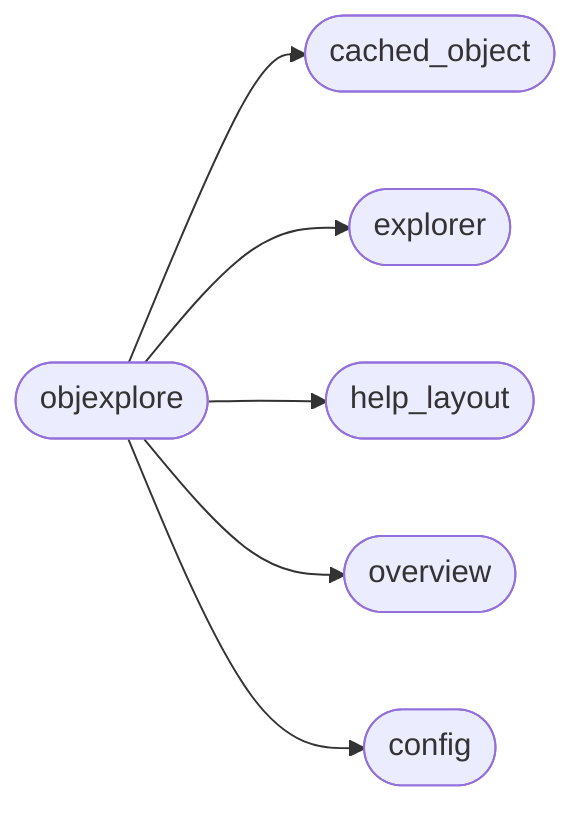
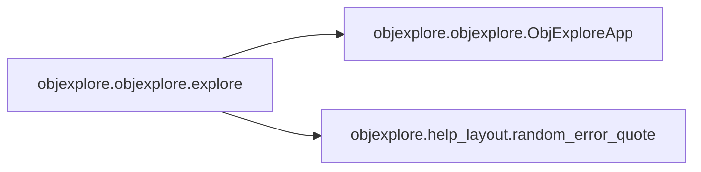

# Objexplore Objexplore

[_Documentation generated by Documatic_](https://www.documatic.com)

<!---Documatic-section-Codebase Structure-start--->
## Codebase Structure

<!---Documatic-block-system_architecture-start--->

<!---Documatic-block-system_architecture-end--->

# #
<!---Documatic-section-Codebase Structure-end--->

<!---Documatic-section-objexplore.objexplore.explore-start--->
## [objexplore.objexplore.explore](3-objexplore_objexplore.md#objexplore.objexplore.explore)

<!---Documatic-section-explore-start--->


### Object Calls

* [objexplore.objexplore.ObjExploreApp](3-objexplore_objexplore.md#objexplore.objexplore.ObjExploreApp)
* objexplore.help_layout.random_error_quote

<!---Documatic-block-objexplore.objexplore.explore-start--->
<details>
	<summary><code>objexplore.objexplore.explore</code> code snippet</summary>

```python
def explore(obj: Any) -> Any:
    frame = inspect.currentframe()
    name = frame.f_back.f_code.co_names[1]
    app = ObjExploreApp(obj, name=name)
    try:
        return app.explore()
    except Exception as err:
        print(app.term.move_down(app.term.height))
        console.print_exception(show_locals=True)
        print()
        rich.print(f'[red]{random_error_quote()}')
        formatted_link = f'https://github.com/kylepollina/objexplore/issues/new?assignees=&labels=&template=bug_report.md&title={err}'.replace(' ', '+')
        print('Please report the issue here:')
        rich.print(f'   [link={formatted_link}][u]{formatted_link}[/u][/link]')
        print()
        rich.print('[yellow italic]Make sure to copy/paste the above traceback to the issue page to make this quicker to fix :)')
```
</details>
<!---Documatic-block-objexplore.objexplore.explore-end--->
<!---Documatic-section-explore-end--->

# #
<!---Documatic-section-objexplore.objexplore.explore-end--->

<!---Documatic-section-objexplore.objexplore.ObjExploreApp-start--->
## [objexplore.objexplore.ObjExploreApp](3-objexplore_objexplore.md#objexplore.objexplore.ObjExploreApp)

<!---Documatic-section-ObjExploreApp-start--->
<!---Documatic-block-objexplore.objexplore.ObjExploreApp-start--->
<details>
	<summary><code>objexplore.objexplore.ObjExploreApp</code> code snippet</summary>

```python
class ObjExploreApp:
    error_style = Style(color='red')
    main_style = Style(color='blue')
    term = Terminal()

    def __init__(self, obj: Any, name: str):
        cached_obj = CachedObject(obj, attr_name=name)
        cached_obj.cache()
        self.explorer = Explorer(term=self.term, cached_obj=cached_obj)
        self.overview = Overview(term=self.term, version=version)
        try:
            signal.signal(signal.SIGWINCH, self.draw)
        except AttributeError:
            pass

    def explore(self) -> Optional[Any]:
        """ Open the interactive explorer. This is the main running loop """
        key = None
        res = None
        print(self.term.clear, end='')
        with self.term.cbreak(), self.term.hidden_cursor():
            while True:
                try:
                    self.draw()
                    key = self.term.inkey()
                    self.process_key_event(key)
                except RuntimeError as err:
                    if err.args[0] == "reentrant call inside <_io.BufferedWriter name='<stdout>'>":
                        pass
                    else:
                        raise err
                except StopIteration:
                    if key == 'r':
                        res = self.explorer.selected_object.obj
                    break
        print('\x1b[?25h', end='')
        return res

    def process_key_event(self, key: Keystroke) -> Any:
        """ Process the incoming key """
        if self.explorer.filter.receiving_input:
            if key.code == self.term.KEY_BACKSPACE:
                self.explorer.filter.backspace(cached_obj=self.explorer.cached_obj, live_update=self.explorer.live_update)
            elif key.code == self.term.KEY_ESCAPE:
                self.explorer.filter.cancel_search(self.explorer.cached_obj)
            elif key.code == self.term.KEY_ENTER:
                self.explorer.filter.end_search(cached_obj=self.explorer.cached_obj)
            elif key.code == self.term.KEY_LEFT:
                self.explorer.filter.cursor_left()
            elif key.code == self.term.KEY_RIGHT:
                self.explorer.filter.cursor_right()
            elif key.code in (self.term.KEY_UP, self.term.KEY_DOWN):
                return
            else:
                self.explorer.filter.add_search_char(key=key, cached_obj=self.explorer.cached_obj, live_update=self.explorer.live_update)
            return
        if key in ('q', 'Q', 'r'):
            raise StopIteration
        if self.overview.help_layout.visible:
            if key == '?' or key.code in (self.term.KEY_ESCAPE, self.term.KEY_BACKSPACE):
                self.overview.help_layout.visible = False
                return
            elif key == 'f':
                with console.capture() as capture:
                    console.print(self.overview.help_layout.text)
                str_out = capture.get()
                pydoc.pager(str_out)
                return
            elif key in ('{', '}', '[', ']'):
                if self.overview.help_layout.state == HelpState.keybindings:
                    self.overview.help_layout.state = HelpState.about
                elif self.overview.help_layout.state == HelpState.about:
                    self.overview.help_layout.state = HelpState.keybindings
                return
            elif key in ('j', 'k', 'o', 'n') or key.code in (self.term.KEY_UP, self.term.KEY_DOWN):
                self.overview.help_layout.visible = False
            else:
                return
        if key == '?' and self.overview.help_layout.visible is False:
            self.overview.help_layout.visible = True
            return
        if key == 'o':
            if self.explorer.stack.layout.visible:
                self.explorer.stack.layout.visible = False
            elif self.explorer.filter.layout.visible:
                self.explorer.filter.layout.visible = False
                self.explorer.stack.set_visible()
            else:
                self.explorer.stack.set_visible()
        elif key.code in (self.term.KEY_BACKSPACE, self.term.KEY_ESCAPE) and self.explorer.stack.layout.visible:
            self.explorer.stack.layout.visible = False
        elif (key == ' ' or key.code == self.term.KEY_ENTER) and self.explorer.stack.layout.visible:
            self.explorer.explore_selected_stack_object()
        elif (key == 'j' or key.code == self.term.KEY_DOWN) and self.explorer.stack.layout.visible:
            self.explorer.stack.move_down()
        elif (key == 'k' or key.code == self.term.KEY_UP) and self.explorer.stack.layout.visible:
            self.explorer.stack.move_up()
        elif key == 'g' and self.explorer.stack.layout.visible:
            self.explorer.stack.move_top()
        elif key == 'G' and self.explorer.stack.layout.visible:
            self.explorer.stack.move_bottom()
        elif key in ('l', '[', ']', '{', '}', 'h') and self.explorer.stack.layout.visible:
            return
        elif key == 'n':
            if self.explorer.filter.layout.visible:
                self.explorer.filter.layout.visible = False
            elif self.explorer.stack.layout.visible:
                self.explorer.stack.layout.visible = False
                self.explorer.filter.layout.visible = True
            else:
                self.explorer.filter.layout.visible = True
        elif key == '/' and (not self.explorer.filter.receiving_input):
            self.explorer.stack.layout.visible = False
            self.explorer.filter.receiving_input = True
            self.explorer.filter.layout.visible = True
        elif (key == ' ' or key.code == self.term.KEY_ENTER) and self.explorer.filter.layout.visible:
            self.explorer.filter.toggle(self.explorer.cached_obj)
            self.explorer.reset_index()
        elif key.code in (self.term.KEY_ESCAPE, self.term.KEY_BACKSPACE) and self.explorer.filter.layout.visible:
            self.explorer.filter.layout.visible = False
        elif (key == 'j' or key.code == self.term.KEY_DOWN) and self.explorer.filter.layout.visible:
            self.explorer.filter.move_down()
        elif (key == 'k' or key.code == self.term.KEY_UP) and self.explorer.filter.layout.visible:
            self.explorer.filter.move_up()
        elif key == 'g' and self.explorer.filter.layout.visible:
            self.explorer.filter.move_top()
        elif key == 'G' and self.explorer.filter.layout.visible:
            self.explorer.filter.move_bottom()
        elif key == 'c':
            self.explorer.filter.clear_filters(self.explorer.cached_obj)
        elif key == 'k' or key.code == self.term.KEY_UP:
            self.explorer.move_up()
        elif key == 'j' or key.code == self.term.KEY_DOWN:
            self.explorer.move_down()
        elif key in 'l' or key.code in (self.term.KEY_ENTER, self.term.KEY_RIGHT, self.term.KEY):
            self.explorer.explore_selected_object()
        elif (key == 'h' or key.code == self.term.KEY_LEFT) and self.explorer.stack.stack:
            self.explorer.explore_parent_obj()
        elif key == 'g':
            self.explorer.move_top()
        elif key == 'G':
            self.explorer.move_bottom()
        elif key in ('[', ']'):
            if self.explorer.state == ExplorerState.public:
                self.explorer.state = ExplorerState.private
            elif self.explorer.state == ExplorerState.private:
                self.explorer.state = ExplorerState.public
        elif key == '+':
            self.explorer.increase_width()
        elif key in ('_', '-'):
            self.explorer.decrease_width()
        elif key == '=':
            self.explorer.extra_width = 0
        elif key in ('{', '}'):
            if not callable(self.explorer.selected_object.obj):
                return
            if self.overview.preview_state == PreviewState.repr:
                self.overview.preview_state = PreviewState.source
            elif self.overview.preview_state == PreviewState.source:
                self.overview.preview_state = PreviewState.repr
        elif key == 'd':
            self.overview.state = OverviewState.docstring if self.overview.state != OverviewState.docstring else OverviewState.all
        elif key == 'p':
            self.overview.state = OverviewState.value if self.overview.state != OverviewState.value else OverviewState.all
        elif key == 'f':
            printable: Union[str, Syntax, Text]
            if self.overview.state == OverviewState.docstring:
                printable = self.explorer.selected_object.docstring
            elif self.overview.preview_state == PreviewState.repr:
                printable = self.explorer.selected_object.obj
            elif self.overview.preview_state == PreviewState.source and self.explorer.selected_object._source:
                printable = self.explorer.selected_object.get_source(fullscreen=True)
            else:
                printable = self.explorer.selected_object.obj
            with console.capture() as capture:
                console.print(printable)
            str_out = capture.get()
            pydoc.pager(str_out)
        elif key == 'O':
            try:
                path = inspect.getabsfile(self.explorer.selected_object.obj)
                subprocess.call([EDITOR, path])
                print('\x1b[?25l', end='')
            except Exception:
                self.error()
        elif key == 'H':
            help(self.explorer.selected_object.obj)
        elif key == 'i':
            with console.capture() as capture:
                rich.inspect(self.explorer.selected_object.obj, console=console, methods=True)
            str_out = capture.get()
            pydoc.pager(str_out)
        elif key == 'I':
            with console.capture() as capture:
                rich.inspect(self.explorer.selected_object.obj, console=console, all=True)
            str_out = capture.get()
            pydoc.pager(str_out)

    def draw(self, *_):
        """ Draw the application. the *_ argument is due to resize events and are unused """
        print(self.term.home, end='')
        layout = Layout()
        layout.split_row(self.explorer.get_layout(), self.overview.get_layout(self.explorer.selected_object))
        title = self.explorer.cached_obj.dotpath + Text(' | ', style='white') + self.explorer.cached_obj.typeof
        object_explorer = Panel(layout, title=title, subtitle='[red][u]q[/u]:quit[/red] [cyan][u]?[/u]:help[/] [bright_blue][u]o[/u]:stack [/bright_blue][bright_magenta][u]n[/u]:filter [/bright_magenta][aquamarine1][u]/[/u]:search [/aquamarine1][u]r[/u]:return', subtitle_align='left', height=self.term.height - 1, style=self.main_style, box=box_type)
        rich.print(object_explorer, end='')

    def error(self):
        """ Color the outside red and pause for a split second """
        self.main_style = self.error_style
        self.draw()
        time.sleep(0.25)
        self.main_style = self.main_style
```
</details>
<!---Documatic-block-objexplore.objexplore.ObjExploreApp-end--->
<!---Documatic-section-ObjExploreApp-end--->

# #
<!---Documatic-section-objexplore.objexplore.ObjExploreApp-end--->

[_Documentation generated by Documatic_](https://www.documatic.com)